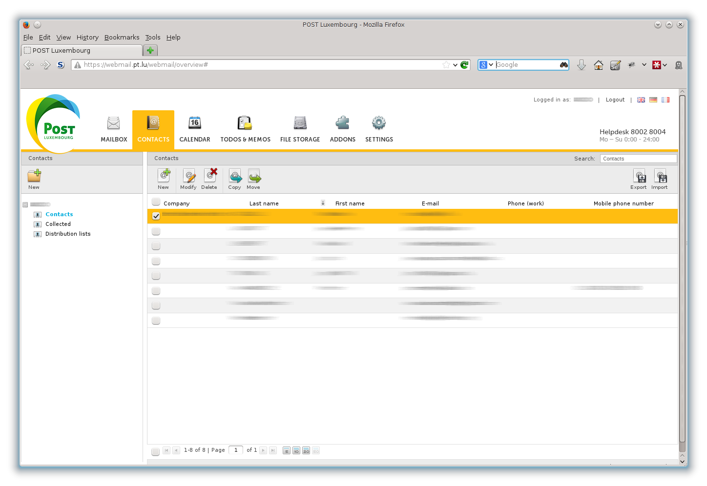

# P&T Luxembourg Webmail Addressbook Injection
=============================================

## What is this

Inject addressbook data into the P&amp;T Luxembourg webmail address book via its web interface using the Selenium WebDriver.

This code fulfills two needs:

   * Getting acquainted with Selenium WebDriver.
     (see in particular [Selenium WebDriver by Simon Stewart](http://aosabook.org/en/selenium.html) for an introduction)
   * Getting our sports club's address list, currently in an Excel sheet, into P&T Webmail (at one time
     I will have to write a Grails app, fer sure).

The P&T Luxembourg webmail interface unfortunately is a cow to drive via Selenium. The DOM objects have no ids and are
hard to locate via XPath or via text search, it is unsure in what state the application is at any moment (unless 
one looks of course) and random delays in page rebuilds and Ajax refreshes may occur. 

Consequently this code is brittle: it works in the current instantiation but only with certain probability
and only if one adds judicious calls to `sleep()`. It also breaks whenever something changes in the Webmail interface.

Found to be of extremely valuable use in this endeavor:

   * The Firefox Web Developer tools
   * The Firefox [Firebug plugin](https://addons.mozilla.org/de/firefox/addon/firebug/).

The look of that interface was somewhat updated end of 2013:

## Status

- Released 2013
- Unmaintained, of historical interest only
- Definitely not of general interest

## License

[MIT License](http://opensource.org/licenses/MIT)
